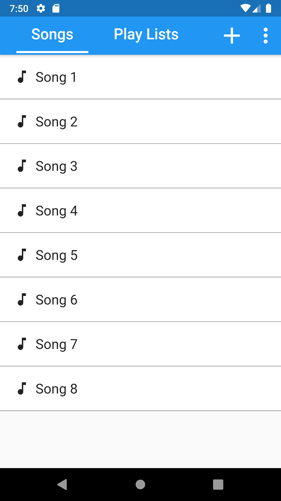
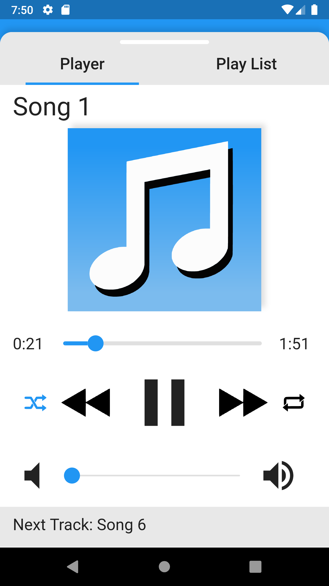
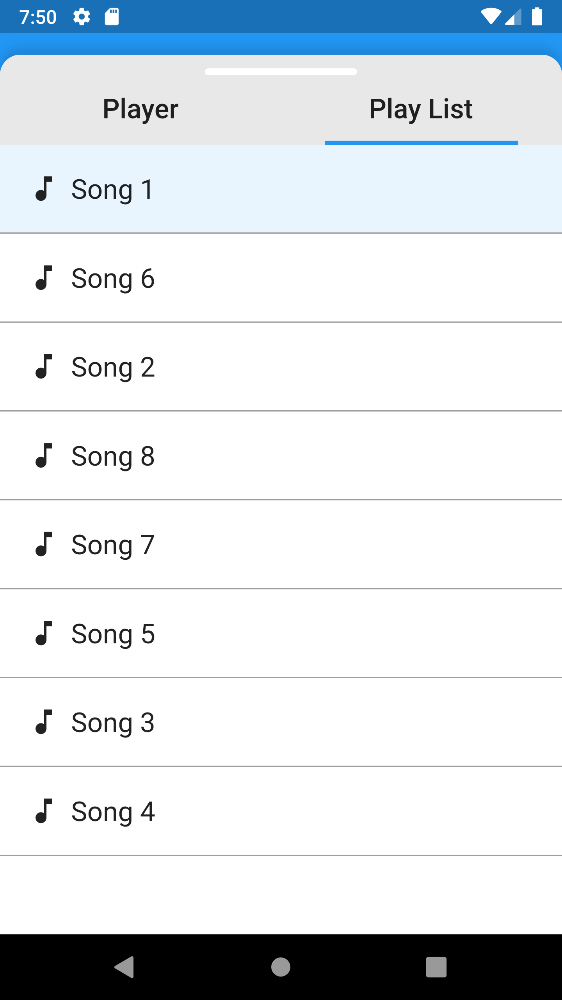

# Play Master

Play Master is an app that allows you to import mp3 files that are on your phone and play them. It also features flexible playlist functionality that allow you to customize playlists to fit any situation.

## ScreenShots
Here are some screenshots of what the app currently looks like:
 
 

&nbsp;&nbsp;&nbsp;&nbsp;&nbsp;&nbsp;&nbsp;&nbsp;&nbsp;&nbsp;

 
 

&nbsp;&nbsp;&nbsp;&nbsp;&nbsp;&nbsp;&nbsp;&nbsp;&nbsp;&nbsp;

 
 

